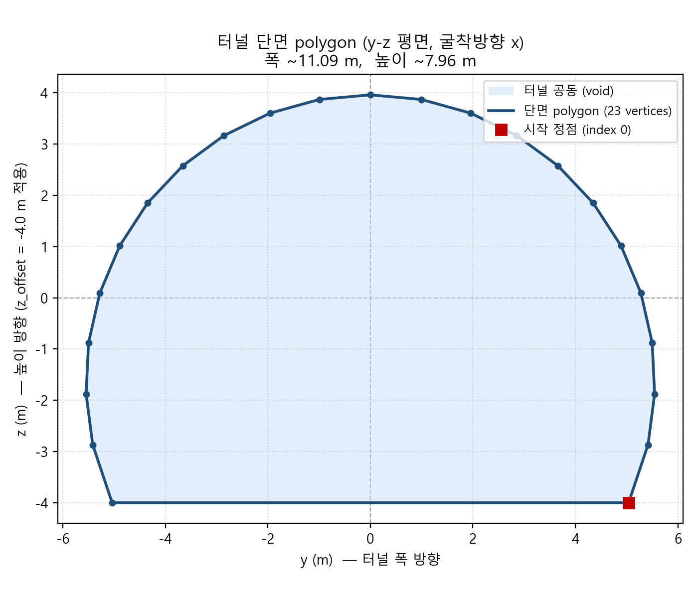

# 3. 가상 암반균열망 생성 알고리즘

본 장은 막장면에서 관측된 2차원 trace로부터 절리 통계 파라미터를 추출하고, 이를 이용해 관측 균열과 미관측 균열을 포함하는 3차원 가상 암반균열망을 생성하는 알고리즘을 기술함. 3.1(전처리), 3.2.1(방향성·집중도 κ), 3.2.2(반지름 지수 k_r·강도 P32)는 구현·검증이 완료되었으며, 3.2.3의 연결성분 병합과 3.3의 생성 통합은 설계 및 부분 구현 단계임.

> 본 장의 결과 수치(표 3-1)는 `storage/output/pipeline_test_laxemar/` 파이프라인 실행 결과(DFN 생성 → rough face mesh(0/1/2/3 m) → trace 추출 → kr/P32/방향성 역산 → GT 비교)를 기준으로 함.

## 3.1 절리 전처리

각 막장면은 굴진 방향(x축)에 수직한 단면이며, 막장면 위 좌표는 face-local 좌표 (y, z)로 표현함. 하나의 trace는 해당 단면상의 2차원 선분으로, 양 끝점 P1 = (y1, z1), P2 = (y2, z2)로 주어지고, 3차원 좌표로는 막장면 위치 x_face를 포함하여 P1_3D = (x_face, y1, z1)로 표현함.

### 3.1.1 막장면(excavation face) mesh 생성 및 trace 획득

관측 대상인 막장면은 합성 rough face mesh로 모사함. 실제 굴착면은 완전한 평면이 아니라 미세 요철을 가지며, 이 요철이 절리–막장면 교선(trace)에 곡률을 부여하여 3차원 normal 회수를 가능케 하므로(3.2.1), 막장면을 평면이 아닌 거친 삼각 mesh로 생성함.

**터널 단면 polygon 제공 형식**: 터널 단면 경계는 텍스트 형식의 DAT 파일(`storage/data/단면_폴리곤.dat`)로 제공되며, 단면 외곽을 순서대로 잇는 정점 목록(23개 정점)으로 정의됨. 동일 단면이 파일 내 두 블록으로 중복 표기되어 있음 — (a) 3D 표기 `X=<값>  Y=<값>  Z=<값>`(Z=0), (b) 2D 표기 `(<y>, <z>)`. 좌표 단위는 mm이며 코드에서 m로 환산함(×0.001). 막장면 mesh 생성기는 2D 괄호 `(y, z)` 블록을 파싱하여 face-local (y, z) 좌표로 사용하고, 시작 정점을 끝에 반복하여 폐다각형으로 닫음. 본 단면은 폭 약 11.1 m(y: ±5.545 m), 높이 약 7.96 m(z: 0~7.961 m)의 아치형(볼록) 단면이며, z_offset −4.0 m를 적용해 DFN 좌표계 중심에 맞춤. 향후 실제 현장 자료 적용 시에도 동일하게 순서 있는 (y, z) 정점 목록 형태의 단면 경계를 입력으로 사용함.

터널 굴착 방향이 x이므로 단면 polygon은 굴착 방향에 수직인 y-z 평면에 정의됨(그림 3-1). 바닥은 z = −4.0 m의 평평한 면이고 상부는 볼록한 아치형이며, 이 (y, z) 경계가 막장면 mesh의 외곽과 절리 trace의 관측창(observation window)을 동시에 규정함.

*그림 3-1. 터널 단면 polygon (y-z 평면). 굴착 방향은 지면에 수직인 x 방향이며, 단면은 폭 약 11.1 m·높이 약 7.96 m의 아치형 볼록 다각형(23개 정점)임. 붉은 사각형은 정점 순서의 시작점(index 0).*

생성 절차는 다음과 같음.

1. **터널 단면 polygon 입력**: 단면 polygon(.dat)을 mm→m로 환산하고 z-offset(기본 −4.0 m)을 적용하여 DFN의 `/tunnel/poly_YZ` 좌표계와 정합함.
2. **규칙 격자 구성**: polygon의 y-z bounding box 안에 `grid_step`(기본 0.2 m) 간격의 규칙 격자를 생성함.
3. **내부 mask**: 격자점 중 polygon 내부에 있는 점만 유지함(point-in-polygon).
4. **roughness field 생성**: 굴진 방향(x)으로의 요철 오프셋장을 백색 가우시안 잡음에 Gaussian filter(σ = `corr_length`/`grid_step`)를 적용해 공간 상관을 부여하고, RMS 진폭이 `amplitude`가 되도록 정규화함. 즉 상관길이 `corr_length`, RMS 진폭 `amplitude`인 Gaussian random field임.
5. **삼각 mesh화**: 내부 격자점을 정점 `(x = face_x + rough_x, y, z)`로 두고, 내부에 완전히 포함되는 2×2 셀마다 삼각형 2개를 구성하여 삼각 mesh(정점·삼각형 배열)를 만듦.
6. **막장면 collection 생성**: 굴진 단계별 막장면 위치마다 서로 다른 seed로 독립적인 요철 realization을 생성하여 `/rough_faces` collection으로 저장함. 단일 mesh를 평행이동해 재사용하지 않고, 막장면별 독립 geometry를 전처리·관리하여 굴진 단계별로 실제로 다른 관측면을 반영함.

**trace 획득**: 각 절리 원판(평면)과 해당 막장면 삼각 mesh를 교차시켜 선분열(polyline)을 산출하고, 끝점 그래프로 연결하여 하나의 trace로 묶음. 이렇게 얻어진 trace가 이하 전처리(3.1.2~3.1.4)의 입력이 됨.

roughness 진폭이 작으면 trace가 거의 직선이 되어 유효 normal 회수가 감소하므로(3.2.1), `amplitude`는 방향 회수율과 막장면 사실성의 절충으로 설정함. 본 시험에서는 `grid_step` = 0.2 m, `amplitude` = 0.05 m, `corr_length` = 1.0 m, 막장면 4개(x = 0/1/2/3 m)를 사용함.

### 3.1.2 길이, 중심점, 2차원 방향각 계산

각 trace에 대해 다음을 계산함.

- **trace 길이**: `L = sqrt((y2 − y1)^2 + (z2 − z1)^2)`
- **중심점**: `C = ((y1 + y2)/2, (z1 + z2)/2)`, 3차원 표현 `C_3D = (x_face, yc, zc)`
- **2차원 방향각**: `θ = atan2(z2 − z1, y2 − y1)`

관측 길이 L은 막장면과 3차원 균열 원판이 교차하여 생긴 chord의 관측 부분이며, 터널 경계에 의한 절단(censoring) 때문에 실제 chord보다 짧을 수 있음(3.1.3).

### 3.1.3 터널 경계와의 접촉 유형 분류 (censoring class)

각 막장면의 터널 경계는 y-z 평면상의 2차원 polygon으로 정의함. 각 trace endpoint의 polygon 내부·경계 교차 여부(point-in-polygon)를 판정하여 다음 세 유형으로 분류함.

- **Type 0 (내부 trace)**: 양 끝점 모두 경계 내부. 관측 길이가 실제 chord에 가까움.
- **Type 1 (한 끝 교차 trace)**: 한쪽 끝점이 경계에 접하거나 밖으로 절단됨. 실제 chord가 관측 길이보다 길 수 있음.
- **Type 2 (양 끝 교차 trace)**: 양쪽 끝점이 모두 경계와 교차. 실제 chord가 관측 길이보다 클 가능성이 큼.

(polygon과 전혀 겹치지 않아 관측 불가한 선분은 별도 무효값으로 제외.) 이 분류는 반지름 분포 보정(3.2.2)의 핵심 입력이며, 경계에 잘린 trace를 완전 관측 trace와 동일하게 취급하면 반지름 분포가 왜곡되므로 반드시 구분함.

### 3.1.4 임계값 이하 짧은 trace 제거

임계 길이 미만 trace는 (1) 측정·검출 오차 민감, (2) 노이즈·미세 파쇄 가능성, (3) 방향각 계산 불안정, (4) power-law 하한부 bias 유발, (5) 경계 clipping 효과와 구분 곤란의 이유로 제거함. 현 단계에서 임계값은 최적화된 물리 상수가 아니라 **분석 안정성을 위한 품질관리 기준**이며, 향후 임계값 민감도 분석(kr·P32·bootstrap CI 변화 확인)으로 최종 기준을 결정할 예정임.

## 3.2 절리 통계 정보 추출

### 3.2.1 절리군별 밀도, 방향성(trend/plunge), 집중도 κ 추정

절리군별 방향성은 여러 막장면에서 관측된 동일 절리군 trace들의 3차원 국소 normal로부터 추정함. 개별 trace의 국소 normal은 rough face mesh 위 trace polyline의 **3점법**(chord와 최대 편차점)으로 추정하며, 비공선성 품질값 `quality = 최대편차 / chord길이`가 임계값 이상일 때만 유효 normal로 채택함. 평평한 막장면에서는 두 평면의 교선이 직선이 되어 normal을 특정할 수 없으므로, **막장면 roughness가 유효 normal 회수의 필수 조건**임(진폭이 작으면 유효 normal 수가 줄어듦).

**(1) 3점법 국소 normal (외적).** trace polyline의 양 끝점을 $\mathbf{p}_0,\ \mathbf{p}_1\in\mathbb{R}^3$, chord 벡터를 $\mathbf{c}=\mathbf{p}_1-\mathbf{p}_0$라 하면, chord로부터 수직 거리가 최대인 중간점 $\mathbf{p}_m$을 다음으로 선정함.

$$
\mathbf{p}_m=\arg\max_{\mathbf{p}_i}\ d(\mathbf{p}_i)=\arg\max_{\mathbf{p}_i}\ \frac{\lVert(\mathbf{p}_i-\mathbf{p}_0)\times\mathbf{c}\rVert}{\lVert\mathbf{c}\rVert}
$$

절리면–막장면 교선(trace)은 국소적으로 절리 평면 위에 놓이므로, chord 벡터 $\mathbf{c}$와 $\mathbf{p}_m-\mathbf{p}_0$ 두 벡터는 그 평면에 접함. 따라서 두 벡터의 **외적(cross product)**이 절리면 법선 방향을 주며, 정규화하여 국소 normal을 추정함.

$$
\hat{\mathbf{n}}=\frac{\mathbf{c}\times(\mathbf{p}_m-\mathbf{p}_0)}{\lVert\mathbf{c}\times(\mathbf{p}_m-\mathbf{p}_0)\rVert},
\qquad
\text{quality}=\frac{\max_i d(\mathbf{p}_i)}{\lVert\mathbf{c}\rVert}
$$

여기서 quality는 최대 수직편차를 chord 길이로 나눈 무차원 비공선성 지표이며, 세 점이 거의 일직선(평평한 막장면)이면 외적의 크기가 0에 가까워져 $\hat{\mathbf{n}}$이 불안정해지므로 $\text{quality}\ge$ 임계값(기본 0.005)인 trace만 채택함.

**(2) 축성(axial) 평균 방향.** normal은 부호가 정해지지 않은 축벡터(axial)이므로, 절리군 내 각 $\hat{\mathbf{n}}_i$를 기준 벡터와 같은 반구로 정렬($\hat{\mathbf{n}}_i\leftarrow\operatorname{sign}(\hat{\mathbf{n}}_i\cdot\hat{\mathbf{n}}_{\mathrm{ref}})\,\hat{\mathbf{n}}_i$)한 뒤 벡터합의 방향을 평균 normal로 취함.

$$
\mathbf{R}=\sum_{i=1}^{N}\hat{\mathbf{n}}_i,\qquad
\bar{\mathbf{n}}=\frac{\mathbf{R}}{\lVert\mathbf{R}\rVert},\qquad
\bar{R}=\frac{\lVert\mathbf{R}\rVert}{N}
$$

**(3) Fisher 집중도 κ.** 정렬된 합성벡터 길이의 평균 $\bar{R}\in[0,1]$로부터 3차원 Fisher 분포 집중도를 근사함($\bar{R}\to1$이면 $\kappa\to\infty$).

$$
\hat{\kappa}=\frac{3\bar{R}-\bar{R}^{3}}{1-\bar{R}^{2}}
$$

**(4) trend/plunge 변환·밀도.** 평균 normal $\bar{\mathbf{n}}$을 아래반구 pole로 변환해 trend/plunge를 얻고, 절리군별 관측 trace 수·강도와 함께 방향 통계를 산정함.

**유의사항(좌표 convention)**: normal→trend/plunge 변환은 DFN 생성에 사용한 pole 벡터 규약과 **동일한 좌표계**에서 수행해야 함. 규약이 어긋나면 동일 방향이 서로 다른 trend(특히 수평에 가까운 pole은 약 180° 차이)로 표기되어 오해를 유발함. 검증 시에는 생성 규약으로 참값 pole 벡터를 구성하고 추정 평균 pole과의 **축 각도차(axial angular error)**로 비교하여 규약 불일치의 영향을 배제하였으며, 표 3-1의 역산 trend/plunge는 참값과 동일 규약으로 정렬한 값임.

### 3.2.2 반지름 지수 k_r 및 강도 P32 추정 (window-aware forward MC, 구현·검증 완료)

반지름 분포(power-law 지수 $k_r$)와 3차원 강도($P_{32}$)는 **동일한 전방(forward) Monte Carlo 모사**를 공유하여 추정함. 관측 trace 길이는 실제 3차원 반지름을 직접 의미하지 않는데, 큰 균열일수록 막장면과 교차할 확률이 높은 **size-bias**와 터널 경계 절단에 의한 **window censoring**이 동시에 작용하기 때문임. 따라서 관측 길이에 power-law를 직접 피팅하거나 관측 trace 수를 그대로 강도로 환산하면 편의가 발생함. 본 연구는 "3차원 원판 → 막장면 교차 → chord 생성 → 터널 polygon clipping"의 관측 과정을 명시적으로 모사하여, 같은 모사기로 $k_r$은 **우도(likelihood)**로, $P_{32}$는 **보정계수(calibration factor)**로 추정함.

공통 모사 요소는 다음과 같음.

- **set-specific effective_rmin** = `max(global_rmin, table_r0)` — power-law 유효 support 정합
- **size-biased radius sampling**: 모집단 $f_R(r)\propto r^{-(k_r+1)}$에서 관측(교차) 확률을 반영해 $g_R(r)\propto r^{-k_r}$로 표집
- **true chord length**: 중심–막장면 거리 $d$에 대해 $\ell_{\text{chord}}=2\sqrt{R^2-d^2}$
- **tunnel face polygon clipping**: 관측 길이와 censoring class(Type 0/1/2) 산출
- **proposal volume/area center weighting**: 균열 중심을 관측 가능 영역에서 균일 표집하고 그 부피/면적으로 가중

#### (A) 반지름 지수 $k_r$ — window-aware MC 우도

관측 길이를 직접 피팅하지 않고, 후보 $k_r$마다 위 전방 모사로 얻은 관측 trace 길이·censoring class 분포와 실제 관측 분포의 우도를 비교하여 profile likelihood를 구성함. censoring class 분율을 우도에 반영하여, 경계에 잘린 trace를 완전 관측 trace와 동일하게 취급했을 때의 왜곡을 방지함.

$$
\hat{k}_r=\arg\max_{k_r}\ \mathcal{L}\big(k_r \mid \{\ell_i^{\text{obs}},\ \text{class}_i\}\big)
$$

불확실성은 관측 trace를 재표집하는 bootstrap으로 $k_r$ 신뢰구간을 산출함. Laxemar Set 2/3는 기존 global rmin에서 $k_r$가 크게 저추정되었으나 set-specific effective_rmin 적용 후 nominal 값 근처로 회복됨 — 반지름 역산에서 support mismatch 보정이 필수적임을 보여줌.

#### (B) 강도 $P_{32}$ — unit-P32 forward-MC 보정

관측면 위 trace 강도(단위 면적당 trace 길이)를 $P_{21}$이라 하면,

$$
P_{21}^{\text{obs}}=\frac{\sum_i \ell_i^{\text{visible}}}{A_{\text{obs}}}
$$

로 정의함($A_{\text{obs}}$: 전체 막장면 관측 면적). $P_{21}$은 균열 밀도에, 따라서 $P_{32}$에 **선형 비례**하므로, 추정된 $k_r$·방향성(Fisher $\kappa$)을 고정하고 **$P_{32}=1$인 기준 DFN**이 동일 관측창에서 만들어 내는 $P_{21}$을 전방 모사로 구해 보정계수 $C$로 삼음.

$$
C=\left.\frac{P_{21}^{\text{sim}}}{P_{32}}\right|_{P_{32}=1},
\qquad
\hat{P}_{32}=\frac{P_{21}^{\text{obs}}}{C}
$$

여기서 기준 DFN의 균열 수밀도는 평균 균열 면적 $\pi\,\mathbb{E}[R^2]$의 역수로 두어($n_0=1/(\pi\mathbb{E}[R^2])$) $P_{32}=1$에 대응시킴. $C$는 여러 replicate로 평균·표준편차를 구하며, $P_{32}$ 신뢰구간은 $k_r$ 신뢰구간 끝값($k_{r,\text{low}},k_{r,\text{high}}$)으로 $C$를 각각 재계산해 전파함(즉 $k_r$ bootstrap × face bootstrap 결합).

#### 진단용 보정

**Kaplan–Meier 보정**은 censoring을 비모수적으로 보정하는 **보조·진단용** 방법으로만 활용하며, $\hat{k}_r$·$\hat{P}_{32}$를 대체하지 않고 censoring·tail 민감도 진단에 한정함.

### 3.2.3 연결성분 분석 및 블록 판별 모듈과 병합 (설계단계)

trace 연결(2장) 결과는 그래프(node=trace, edge=동일 균열 가능성, weight=동일 평면성·방향성·거리 연속성)로 표현함. score 임계값 이하 edge만 유지한 뒤 connected component를 추출하여 하나의 관찰 균열 후보로 정의하고, 각 component를 원판형 균열로 복원함. 이 결과는 블록 판별 모듈과 병합되어 복원 균열이 형성하는 블록 구조 분석의 입력이 됨.

## 3.3 절리망 생성 알고리즘

### 3.3.1 생성 영역 구분

1. **관측 균열 복원 영역**: 막장면 trace로 관측된 균열을 3D 원판으로 복원(2.2), 연결 알고리즘으로 동일 균열 trace 통합하여 실제 관측 정보 유지.
2. **미관측 영역**: 터널 전방·주변부를 추정된 절리군별 통계 파라미터에 따라 조건부 확률적 DFN으로 생성.

### 3.3.2 DFN 생성 파라미터

- **방향성**: normal vector, trend/plunge, Fisher κ
- **반지름 분포**: power-law kr, set_effective_rmin, rmax
- **강도**: P32 (명시된 반지름 support 기준)
- **공간 분포**: 균열 중심의 3차원 Poisson 분포, 터널 domain 및 관심 영역

kr은 effective-rmin + proposal_area window MC로, P32는 unit-P32 forward-MC calibration으로 추정하며, 불확실성은 kr bootstrap × face bootstrap 결합으로 평가함.

### 3.3.3 결과 요약 (Laxemar 벤치마크, 최종)

동일한 common estimator를 모든 절리군에 적용하고 ground truth는 검증 단계에서만 사용한 최종 역산 결과는 다음과 같음. (Set 4는 exponential 분포이므로 power-law kr/P32 대상에서 제외.)

**표 3-1. Laxemar 절리군별 DFN 파라미터 역산 결과 (최종, pipeline_test_laxemar 기준)**

| 절리군 | 관측 trace | 유효 normal | 역산 trend/plunge | 실제 trend/plunge | 방향 각도차 | 역산 κ | 실제 κ | 역산 kr | 실제 kr | kr 오차 | 역산 P32 | 참조 P32 | P32 오차 |
|----|----|----|----|----|----|----|----|----|----|----|----|----|----|
| Set 1 | 182 | 99 | 338.8° / 6.8° | 338.1° / 4.5° | 2.4° | 12.67 | 13.06 | 2.80 | 2.85 | −1.8% | 0.948 | 0.914 | +3.7% |
| Set 2 | 46 | 35 | 107.9° / −0.4° | 100.4° / 0.2° | 7.5° | 17.06 | 19.62 | 3.05 | 3.04 | +0.3% | 0.726 | 1.026 | −29.2% |
| Set 3 | 140 | 94 | 210.4° / 2.4° | 212.9° / 0.9° | 2.9° | 9.19 | 10.46 | 3.05 | 3.01 | +1.3% | 0.945 | 0.975 | −3.1% |
| Set 5 | 186 | 128 | 239.4° / 25.5° | 243.0° / 24.4° | 3.5° | 25.07 | 23.52 | 3.70 | 3.60 | +2.8% | 1.012 | 0.980 | +3.3% |

**해석**

- **방향성(trend/plunge)**: 전 절리군 축 각도차 ≤ 7.5°, Set 1·3·5는 약 2~4°. 2D trace 관측만으로 평균 절리 방향을 신뢰성 있게 복원함. Set 2가 상대적으로 큰 것은 표본이 가장 작기 때문(trace 46, 유효 normal 35)이며, trend 표기는 pole의 축성 특성을 정렬해 실제값과 직접 비교 가능하도록 표시함.
- **집중도 κ**: 대체로 실제값과 유사하며 trace normal 추정 잡음으로 Set 1·2·3은 소폭 과소, Set 5는 소폭 과대. 방향 집중도의 크기 대는 정확히 회수됨.
- **반지름 지수 kr**: 전 절리군 상대오차 ±3% 이내, 평균 절대상대오차 약 1.5%로 가장 안정적으로 복원됨. Set 2 kr조차 +0.3%로 거의 완전 회복.
- **강도 P32**: Set 1·3·5는 ±4% 이내로 우수. Set 2만 −29.2%로 과소추정되며, 이는 추정기 결함이 아니라 support-label 모호성 및 4개 막장면의 face-level P21 변동성에 기인하는 구조적 한계임(unit-P32 oracle·trace export audit은 통과, marginal 분류).

**종합**: 2D 막장면 trace 관측만으로 절리군별 3D 방향성(각도차 <8°), 반지름 분포 kr(±3%), 강도 P32(Set 2 제외 ±4%)를 안정적으로 역산할 수 있음을 확인함. 이는 forward(생성)–inverse(역산) 벤치마크가 정상 작동함을 보여주며, 잔여 불일치(Set 2 P32)는 관측 한계로 해석됨.

---

## 질문 답변

**Q1. 2차원 방향각을 구하는 이유?**
단일 막장면의 2D 방향각만으로는 3D 균열면 방향을 완전히 결정할 수 없으나, (1) 동일 막장면 내 방향성 분류, (2) 동일 절리군 후보 선별, (3) 인접 막장면 간 trace 연결 후보 제한, (4) trace 품질 검토, (5) 3D normal 추정의 보조 정보로 사용됨. 여러 막장면의 위치 변화와 2D 방향의 조합으로 3D normal·trend·plunge를 추정하므로, 2D 방향각은 **최종 방향 파라미터가 아니라 절리군 분류·3D 방향 추정을 위한 관측 feature**임.

**Q2. 길이·중심점·2차원 방향각·터널 경계 형상의 정의와 계산법?**
막장면 local (y, z) 좌표계에서 `L = sqrt((y2−y1)^2+(z2−z1)^2)`, `C = ((y1+y2)/2,(z1+z2)/2)`(3D는 x_face 포함), `θ = atan2(z2−z1, y2−y1)`. 터널 경계는 y-z 평면의 2D polygon으로 정의하고, endpoint의 polygon 내부·경계 교차 여부로 censoring class를 결정함. 이 polygon clipping은 window-aware MC likelihood와 P32 unit-P32 forward MC에서 동일하게 적용됨.

**Q3. 임계값?**
임계 길이는 물리적 하한이 아니라 측정 신뢰도가 낮은 짧은 trace·노이즈성 선분을 제외하기 위한 **품질관리 기준**임. 현 단계에서 최적화될 필요는 없으며, 향후 여러 후보에 대한 kr·P32·bootstrap CI 민감도 분석으로 안정적인 범위를 최종 기준으로 결정할 예정임.
