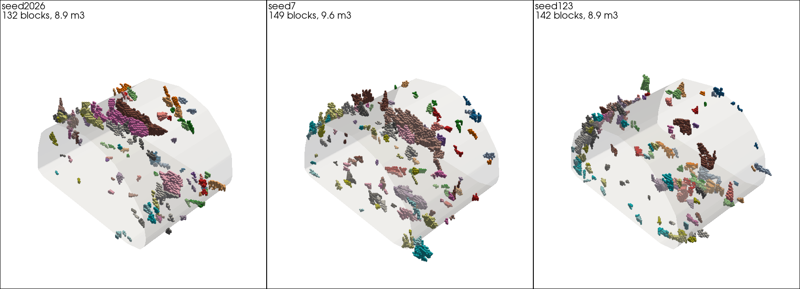
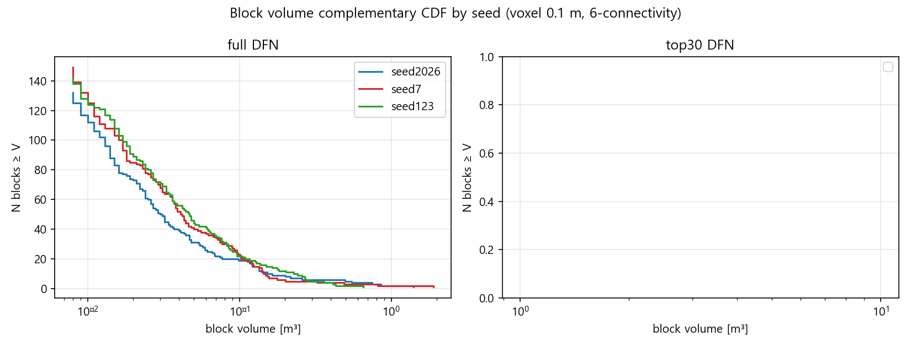
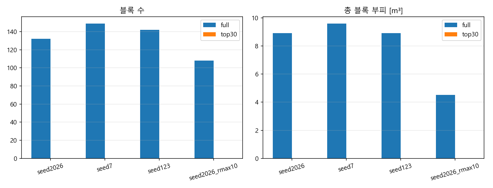
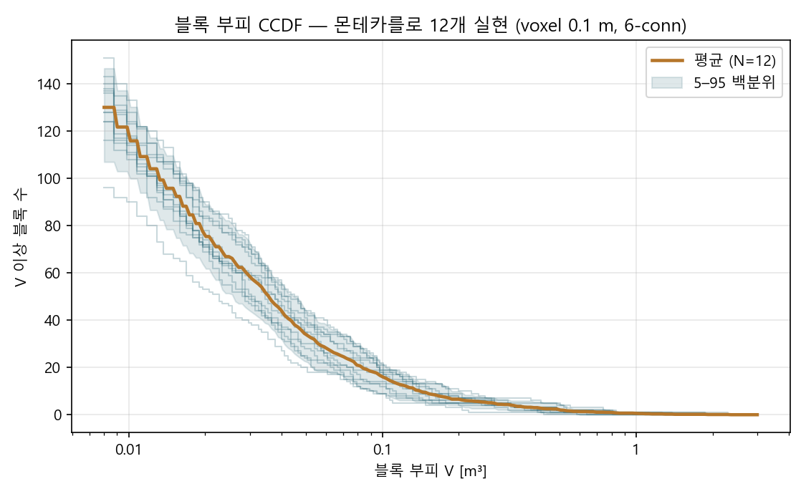
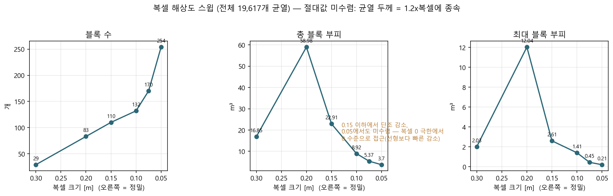
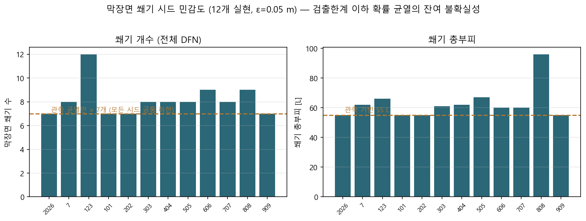
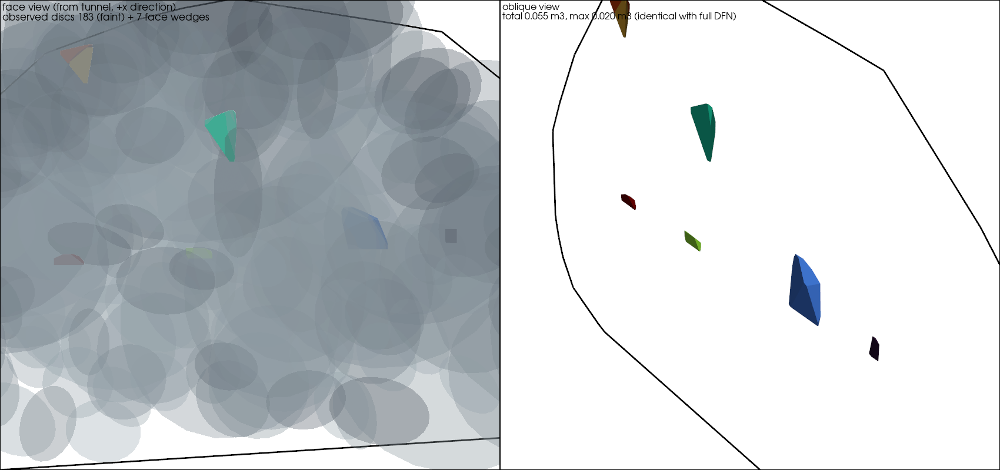

# 블록 판정 시드 민감도 실험 보고 (2026-09-01, 야간 자동 실행)

클라이언트 재질문 ⑤("랜덤 시드에 따라 최종 DFN과 블록이 얼마나 달라지는가, 바뀌면
몬테카를로가 필요한가")를 **블록 수준까지** 정량화한 실험 결과다. DFN 수준 결과(상위
30개 균열이 시드마다 완전히 다름)는 `docs/클라이언트회신_0831_단계별설명_질의응답.md`
R5 참조.

## 방법

- 파이프라인: [7] 도메인 DFN JSON → **복셀 기반 블록 판정** (레거시
  `_archive/block_detection/code`의 block_detector/tunnel_geometry 재사용).
  신규 스크립트: `handoffv1/dfn_analysis/detect_blocks_from_domain_json.py`
- 명시 가정: ① 해석 도메인(마지막 막장면 전방 10 m + halo 5 m)에 터널 단면을
  x 전 구간 연장(전방 굴착 가정), ② 균열 두께 = 복셀×0.6, ③ ROCK CCA
  **6-connectivity**(보수적), ④ 블록 채택 = 터널 접촉 & 도메인 외곽 비접촉,
  min 8 복셀. 복셀 0.1 m (격자 100×225×176 ≈ 396만 복셀).
- 대상: 시드 2026/7/123 (rmax_local 25) + 시드 2026 rmax_local 10, 각각
  {전체 DFN(~1.96만 개), 반지름 상위 30개만} → 총 8회 실행.

## 결과

| run | 균열 수 | 블록 수 | 총부피 [m³] | 최대 [m³] | 중앙값 [m³] |
|---|---|---|---|---|---|
| seed 2026 (full) | 19,617 | 132 | 8.92 | 1.406 | 0.023 |
| seed 7 (full) | 19,430 | **149** | **9.60** | **1.890** | 0.026 |
| seed 123 (full) | 19,393 | 142 | 8.92 | **0.654** | 0.029 |
| seed 2026 rmax10 (full) | 19,594 | 108 | **4.53** | **0.263** | 0.022 |
| 모든 run (top-30만) | 30 | **0** | 0 | — | — |

교차 시드 개별 블록 비교 (full):

| 비교 | 중심 0.5 m·부피비 2배 이내 매칭 | 복셀 Jaccard |
|---|---|---|
| 2026 vs 7 | 12/132 (9%) | 0.039 |
| 2026 vs 123 | 11/132 (8%) | 0.017 |
| 7 vs 123 | 14/149 (9%) | 0.015 |





## 몬테카를로 확장 (12개 실현)

시드 3개만으로는 변동 폭을 과소평가할 수 있어, 시드 9개(101~909)를 추가해 총
**12개 실현**으로 확장했다 (full DFN, 동일 파라미터):

| 지표 | 평균 ± 표준편차 | CV | 범위 |
|---|---|---|---|
| 블록 수 | 137.8 ± 15.3 | 11% | 102 ~ 163 |
| 총 블록 부피 [m³] | 7.95 ± 1.67 | **21%** | 4.16 ~ 10.08 |
| 최대 블록 부피 [m³] | 1.13 ± 0.54 | **48%** | 0.44 ~ 2.32 |



**주의: 최초 3개 시드는 우연히 총부피가 비슷했다(8.9~9.6 m³).** 12개로 보면
총부피도 CV 21%로 무시할 수 없는 변동이 있다. 아래 결론은 12개 실현 기준으로
서술한다.

## 결론 3줄

1. **블록 통계는 "중간 수준" 시드 변동을 가진다**: 블록 수 CV 11%, 총부피 CV 21%,
   최대 블록 CV 48%. 부피 CCDF의 형태(소형 블록 지배 구조)는 실현 간 일관되지만,
   총량은 ±20%, 극값은 ±50% 수준으로 흔들린다 — 극값일수록 시드 지배.
2. **개별 블록은 시드마다 사실상 전부 다르다**: 위치·부피 매칭 8~9%, 복셀
   Jaccard 0.02~0.04. "어디에 어떤 블록이 생기는가"는 한 번의 실현으로 말할 수 없다.
3. **상위 30개 대형 균열만 남기면 블록이 하나도 형성되지 않는다** (모든 시드 공통,
   CCA 컴포넌트 1~15개가 전부 도메인 외곽 접촉). 블록 경계를 닫아주는 것은 소형
   균열들이므로, "대형 균열 상위 N개만 안정성 해석에 입력"하는 방식은 블록 형성
   메커니즘 자체를 제거한다. 균열 개수를 줄이려면 반지름 기준이 아니라 **블록 판정
   후 위험 블록을 만드는 균열 부분집합**을 남기는 쪽이 타당하다.

## 복셀 해상도 스윕 (2026-09-01 추가)

전체 19,617개 균열, 복셀 0.3→0.05 스윕 결과 **절대값은 수렴하지 않는다**:
블록 수 29→254개(증가 지속), 총부피 22.9→3.7 m³(0.15 이하 단조 감소, 선형보다
빠르게 0 수준으로 접근). 원인: 복셀 방식의 균열 두께가 1.2×복셀로 해상도에
종속되고, 두께를 복셀보다 얇게 주면(진단 런: 0.1 m 격자 + 두께 6 cm) 균열면에
구멍이 생겨 블록이 거의 사라진다(3개). 즉 **복셀 방식에서 "닫힌 블록"의 절대
수치는 두께 정의의 함수**이며, 극한(두께→0)에서는 순수 기하로 닫힌 블록이 거의
없다는 3DEC식 비교의 결론과 일치한다.

- 시드 간·조건 간 **상대 비교는 동일 해상도(0.1 m)에서 유효** — MC 결과의 CV
  수치는 그대로 성립한다.
- **절대값 보고는 피하고**, "두께 t = 복셀×1.2 정의 하에서의 값"임을 명시할 것.
- 실행 시간: 0.1 m 4초, 0.05 m 17초 (GPU CCA) — 해상도가 병목이 아님.



## 이전 회신에 대한 정정 1건

R2에서 "`--rmax-local` 25→10은 결과 영향 미미"라 했으나 이는 **DFN 반지름 통계
기준**의 서술이다. **블록 수준에서는 다르다**: rmax10에서 블록 총부피 8.92→4.53 m³
(−49%), 최대 블록 1.41→0.26 m³(−81%). 희소한 대형 균열 꼬리가 큰 블록 형성을
지배하므로, rmax_local은 계산 편의가 아니라 **블록 결과를 바꾸는 물리 파라미터**로
취급해야 한다. 클라이언트에게 rmax 축소를 권할 때 이 단서를 반드시 붙일 것.

## 클라이언트 질문에 대한 최종 답

- "시드 바꿔도 안 달라졌으면": **바란 대로는 되지 않는다.** 개별 블록은 실현마다
  전부 다르고(매칭 8~9%), 블록 통계조차 총부피 ±21%, 최대 블록 ±48% 변동한다.
  블록 수준의 결론을 한 번의 실현으로 보고하는 것은 통계적으로 정당화되지 않으며,
  **몬테카를로(10개 이상 실현)로 평균±CI를 보고하는 것이 맞다.**
- 다만 부담은 크지 않다: 이번 12개 실현이 이미 그 몬테카를로이며, 실현당 약 5분
  (생성 2분 + 블록 판정 3분)이라 20회도 2시간 이내다. 산출물은 블록 수·총부피·
  최대부피의 평균±CI와 공간 셀별 블록 발생 빈도(위험도 맵)를 권장.

## 재현 명령

```bash
cd handoffv1
# 1) 시드별 도메인 JSON (seed만 변경)
PYTHONPATH=. python -m dfn_analysis.export_domain_dfn_json --pipeline-dir demo_output/dfm_demo \
  --sets 1 2 3 4 --rmax-local 25 --lmin-det 0.5 --seed <SEED>
# 2) 블록 판정
PYTHONPATH=. python -m dfn_analysis.detect_blocks_from_domain_json \
  --json <위 JSON> --voxel 0.1 --connectivity 6 --out-prefix <출력프리픽스> [--top-n 30]
```

원자료: `docs/data/block_seed/` (블록 CSV·요약 JSON 8세트),
시드별 도메인 JSON 4종은 세션 스크래치패드에 있음.
주의: 실험 후 `demo_output/dfm_demo/export/dfn_domain_x22.204-32.204_halo5.json`은
seed 2026 원본으로 복원해 둔 상태다.


---

# 막장면 쐐기 분석 (2026-09-01 추가)

막장면(x=22.204)을 자유면으로 하는 쐐기 판정(`dfn_analysis/detect_face_blocks.py`,
ε=0.05 m): 전방을 미굴착 암반으로 두고 자유면 = 막장면 × 터널 단면 패치.

- **관측 복원 균열 183개만**: 쐐기 7개, 합 0.055 m³(최대 0.020) — 모든 시드에서 동일.
- **주의(순환성)**: "쐐기가 관측 균열로만 형성"되는 것은 부재 조건화가 막장면 관측창에
  0.5 m 이상 절리선을 남길 확률 균열을 지웠기 때문으로, 상당 부분 구성상 결과다.
  이는 관측 사실의 반영이므로 오류는 아니나, 서술은 "검출한계 이상 쐐기는 실측이
  결정(조건화로 보장), 검출한계 이하는 통계 불확실성 잔존"으로 해야 정확하다.
- **검출한계 이하 잔여 불확실성 (12개 실현 몬테카를로)**: 전체 DFN로 재판정 시
  추가 쐐기 0~5개(평균 1.2), 추가 부피 0~41 L(평균 +7.8 L = +14%). 12개 중 4개
  시드는 변화 없음. 최악 실현(seed 808)에서 관측 최대(20 L)의 1.9배인 37 L 쐐기
  1개 발생. 일부 시드는 확률 균열이 관측 쐐기를 더 잘게 쪼개기도 함(최대 부피
  0.020→0.017 감소 사례). 전체적으로 막장면 쐐기 규모는 ≤0.1 m³(스폴링 수준).



