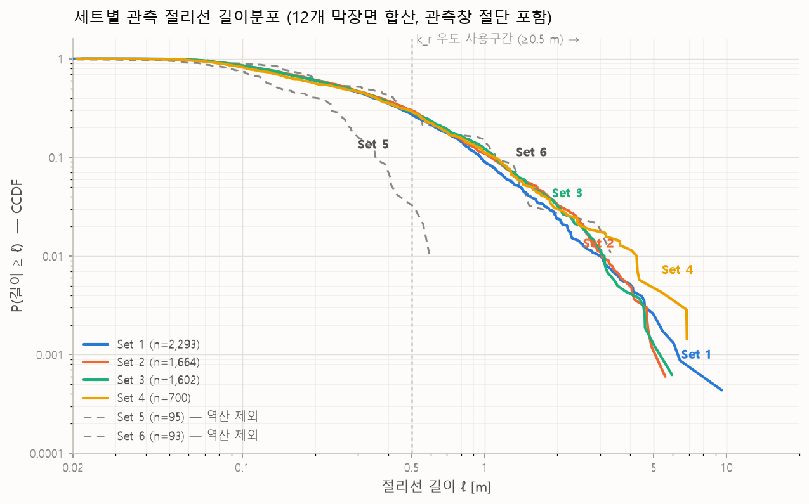

# 파일럿 모듈 구현절차·구현예 — DFM 실측 막장면 12개 적용

2026-08-20 · 입력: DFM_Export (실측 막장면 12개, 2026-08-18 수령) · 파이프라인: handoffv1 v1

## 납품물 구성 (요청 항목 대응)

| 요청 항목 | 위치 |
|---|---|
| 파일럿 모듈 | 본 패키지 (`dfn_analysis/` + `scripts/` + `dfn generator v1/`) |
| 구현절차 | 본 문서 §2 (단계별 실행 명령 = 절차; 전 단계 CLI) |
| 코드 | `dfn_analysis/*.py`, `scripts/convert_dfm_export_to_trace_dataset.py` (전 파일 한글 주석) |
| 구현예 input | `demodata/DFM_Export/` (수령 원본 — 별도 전달 생략 가능) |
| 구현예 output | `example_io/` (해석 입력 JSON 포함) · 전체 산출물은 §2 명령 재실행으로 재현 |
| 그림 | `figures/` (길이분포, 복원 검증 13매, 조건부 진단, 도메인 3D 3매) |

모듈 API·파서 파라미터 총람: `주요함수_사용법.md` / 정책·좌표 규약: `README.md`.

## 1. 입력 데이터와 사용 항목

절리선 6,447개(12개 면, x = −0.4~21.8 m, 간격 1.2~2.9 m 불규칙). 길이 중앙값 0.265 m,
0.5 m 이상 28%, censoring 한끝 8.2%·양끝 2.3%. 파이프라인이 읽는 항목:

| 파일 | 사용 항목 | 용도 |
|---|---|---|
| `2D_trace_data.csv` | B~G열 평면화 끝점 | 절리선 기하 (길이·P21·복원) |
| 〃 | A열 DS | 전역 절리군 재분류 입력 |
| `3D_disk_data.csv` | F~H열 패치 법선 | 방향·κ·환산계수 C (2D와 행 대응 검증) |
| `3D_tunnel_face_point_cloud.ply` | 정점 xyz | 관측면적(0.05 m 점유격자), 관측창 hull, face_x |
| xlsx·사진·DXF·bin | — | 미사용 (검증·육안 확인용) |

주의: 원자료 DS 번호는 면별 클러스터 번호로 **전역 절리군이 아님** (DFM이 면마다 독립
실행). 변환기가 (면,DS) 48개 단위 평균 법선을 30° 절단 계층군집으로 재분류 →
전역 set 6개. 대응표 `example_io/set_mapping.csv`.

| set | n | 관측 면 | 비고 |
|---|---|---|---|
| 1·2·3 | 2,293 / 1,664 / 1,602 | 12/12 | 주 절리군 — 역산 대상 |
| 4 | 700 | 4/12 | 막장면 평행 (C=0.356) — 저신뢰 |
| 5·6 | 95 / 93 | 1~2/12 | 표본 부족 — 역산 제외 |



CCDF: 주 절리군의 멱법칙 꼬리 일치(k_r 3.7~3.85 부합), 0.3 m 이하 평탄화 = 검출한계
(lmin_fit 0.5 m 규약의 근거).

## 2. 구현절차 — 단계별 명령과 결과

handoffv1 루트, `PYTHONPATH=.` 기준. `<B>` = `demo_output/dfm_demo`.

### [0] 변환 (DFM Export → trace dataset)

```
python scripts/convert_dfm_export_to_trace_dataset.py \
  --dfm-dir demodata/DFM_Export/DFM_Export --outdir <B>
```

규약: ① 면 법선 평균 → 터널축 x̂ 정렬(world x̂=[+0.990,−0.021,−0.138]), 실제 3D 좌표 보존
② DS→전역 set 재분류(30° 군집) ③ 관측면적 = 면별 점유격자 합 795.8 m², 대표 관측창 =
중앙값 면 hull ④ 끝점 censoring: 면 hull 경계 0.15 m ⑤ radius_m=NaN, fracture_id=연번.
출력: `trace_dataset_3d.h5/.csv` + 보조 `dfn_export_for_python.h5`(관측 법선·관측창 —
조건부·P32 단계 입력) + 진단 2종.

### [1] k_r 역산

```
python -m dfn_analysis.estimate_kr --trace-h5 <B>/trace_dataset/trace_dataset_3d.h5 \
  --dfn-model dfm_demo --generation-rmin 0.5 --target-set 1 2 3 4 --outdir <B>/kr \
  [--run-bootstrap --n-bootstrap 50]
```

| set | k_r | 95% CI | n(≥0.5 m) |
|---|---|---|---|
| 1 | 3.70 | [3.41, 4.05] | 626 |
| 2 | 3.85 | [3.55, 4.18] | 497 |
| 3 | 3.80 | [3.55, 4.15] | 459 |
| 4 | 3.80 | [3.45, 4.43] | 205 |

hybrid 우도(v1 최종), 전 set provisional_accepted. Laxemar(2.85~3.6)보다 가파름.

### [2] 방향·κ → dataset config

```
python -m dfn_analysis.build_dataset_config_from_traces --trace-h5 <B>/trace_dataset/trace_dataset_3d.h5 \
  --kr-summary-csv <B>/kr/kr_summary_by_set.csv --dataset-name dfm_demo \
  --target-set 1 2 3 4 --out <B>/dataset_config.json
```

trend/plunge/κ = 193.5/46.1/13.1 · 139.6/0.0/15.0 · 24.8/22.8/11.0 · 175.3/4.7/12.5
(패치 법선 축성 평균 + Fisher κ; Terzaghi 미보정 — §4).

### [3] P32 역산 (C = E[sinφ] 해석식)

```
python -m dfn_analysis.estimate_p32_mc_calibrated --trace-h5 <B>/trace_dataset/trace_dataset_3d.h5 \
  --config <B>/dataset_config.json --site dfm_demo --target-set 1 2 3 4 \
  --kr-summary-csv <B>/kr/kr_summary_by_set.csv --bootstrap-csv <B>/kr/kr_summary_by_set.csv \
  --dfn-h5 <B>/dfn_export_for_python.h5 --outcsv <B>/p32/p32_summary.csv
```

| set | P21 [m/m²] | C | P32 [m²/m³] |
|---|---|---|---|
| 1 | 1.294 | 0.736 | **1.758** |
| 2 | 1.002 | 0.659 | **1.521** |
| 3 | 0.962 | 0.590 | **1.632** |
| 4 | 0.423 | 0.356 | **1.188** (저신뢰 — 저C 증폭 ×2.8, 4개 면) |
| 합계 | 3.68 | — | **6.10** |

### [4] 관측 균열 복원 (trace → disc)

```
python -m dfn_analysis.reconstruct_discs_from_traces --trace-h5 <B>/trace_dataset/trace_dataset_3d.h5 \
  --kr-summary-csv <B>/kr/kr_summary_by_set.csv --target-set 1 2 3 4 \
  --max-centroid-sep 3.5 --radius-mode sample --radius-seed 2026 \
  --out-csv <B>/reconstruct/reconstructed_discs.csv
```

응집 연결(중심거리 게이트 3.5 m — 면 간격 반영). disc 4,604개(다면 관통 259 / 원적합 258).
`--radius-mode sample`(신설): 경계 부족 disc의 반지름을 k_r 사후분포에서 표본 추출
(지지구간 max(a, 0.5)~rmax), 자기 면 현 = 관측 chord가 되도록 현 보존 배치, 타 면에
≥0.5 m 현을 남기는 표본은 기각(부재 조건화). 반지름 중앙값 0.58 / p95 1.46 m,
0.5 m 정확값 6%(점추정 모드에서는 81% — 하한 절단 스파이크).

### [5] LOFO 외삽검증

```
python -m dfn_analysis.validate_reconstruction_lofo --trace-h5 <B>/trace_dataset/trace_dataset_3d.h5 \
  --kr-summary-csv <B>/kr/kr_summary_by_set.csv --target-set 1 2 3 4 --max-centroid-sep 3.5
```

전 set recall ≈ 0%: 절리 크기(중앙값 0.27 m) ≪ 면 간격(1.2~2.9 m)이라 면간 연결 자체가
희소 — 알고리즘 실패가 아닌 데이터 기하. 이 데이터의 정보 경로는 통계 역산+조건부 생성.

### [6] 조건부 암반균열망

```
python -m dfn_analysis.generate_conditional_hidden_dfn --pipeline-dir <B> \
  --sets 1 2 3 4 --rmax-local 25 --lmin-det 0.5 --seed 2026
```

hidden 952,089 생성 → 관측 모순 2,368 제거 → visible 4,604 + hidden 949,721 = 954,325.
visible disc κ = 8.8/11.2/9.1/9.3 (config와 동일 규모). visible P21 재현 −29%
(단일 절리선 disc는 현 보존으로 정확, 결손은 다면 disc의 보수적 재현 — 벤치마크와 동일 수준).

### [7] 해석 입력 JSON + 3D

```
python -m dfn_analysis.export_domain_dfn_json --pipeline-dir <B> --sets 1 2 3 4 \
  --rmax-local 25 --lmin-det 0.5 --seed 2026
python -m dfn_analysis.plot_domain_dfn_3d --json <B>/export/dfn_domain_x21.831-31.831_halo5.json \
  --out-dir <B>/export
```

## 3. 구현예 output (`example_io/`)

| 파일 | 내용 |
|---|---|
| `dfn_domain_x21.831-31.831_halo5.json` | **해석 입력 (최종 산출물)** — 도메인 x=[21.83, 31.83] m(전방 10 m) + 단면 halo 5 m 교차 균열 18,825개 (observed 172 / unobserved 18,653), 터널 벽면 절리선 87개 포함, 표 6-4 형식 |
| `p32_summary.csv` / `kr_summary_by_set.csv` | set별 P32·k_r 역산 결과 (CI 포함) |
| `dataset_config.json` | 역산 방향분포 config (P32·조건부 입력) |
| `set_mapping.csv` / `conversion_diagnostics.json` | (면,DS)→전역 set 대응 / 변환 진단 |
| `reconstructed_discs_sample50.csv` | 복원 disc 샘플 (전체 4,604행은 재실행으로 생성) |

JSON 사용 주의:
- observed의 `radius_status=shrinkage_sampled`(156/172)는 측정값이 아닌 조건부 표본 —
  크기 통계는 unobserved(stochastic)와 분리 집계.
- 좌표계는 터널축 정렬(x=굴진방향). world 복원 필요시 x̂=[+0.9902, −0.0208, −0.1384]
  (`conversion_diagnostics.json`).

그림: `figures/` — 길이분포 CCDF, 복원 3D·면별 12매, 관측 vs 조건화 절리선,
도메인 3D iso/top/side.

## 4. 결함 수정 이력 · 한계

**실측 적용에서 발견·수정 (2026-08-20, 코드 반영 완료):**

1. 단일 절리선 disc 법선이 placeholder [1,0,0]으로 기록 (2점 폴리라인 SVD 퇴화 분기) →
   실측 패치 법선 사용으로 수정. 조건화 set 4 κ 발산(6,882)도 동일 원인으로 함께 해소.
2. `disc_face_chord`가 기울어진 disc의 현 반길이를 면내거리(Δx/sinφ) 대신 Δx로 계산 →
   현 과대·hidden 과잉 제거(3,896→2,368). 벤치마크 절리선 생성기는 정상 공식 —
   **k_r·P32 역산 무영향**, 조건부 진단·제거에만 영향.

**남은 한계:** ① set 4 저신뢰(측벽 관측창 확장이 1순위 개선) ② 다면 disc 보수적 현 재현
(visible P21 −29%의 주인) ③ 단일 대표 관측창 근사(면적은 면별 합산이라 P21 정확)
④ 군집 절단각 민감도(25°→8군, 30°/35°→6군) ⑤ Terzaghi 미보정 ⑥ 검출 하한 0.5 m 규약
(현장 검출 완전성 곡선으로 대체 가능).
