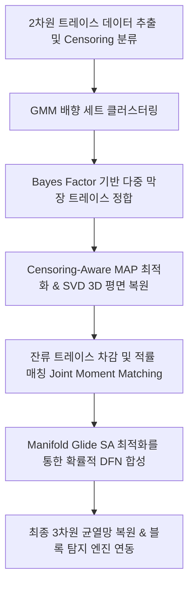

# 터널 막장면 기반 3차원 암반 균열망(3D DFN) 역산 복원 알고리즘 상세 기술 보고서
**Technical Report on 3D DFN Inverse Reconstruction Algorithm from Tunnel Face Traces**

본 보고서는 터널 막장(Tunnel Excavation Faces)에서 관측되는 2차원 균열 흔적(Traces) 데이터로부터 터널 주변 및 암반 내부의 3차원 이산 균열망(Discrete Fracture Network, DFN)을 확률적·확정적으로 복원하는 역산(Inverse Reconstruction) 알고리즘의 수학적 기초, 기하학적 공식 및 세부 연산 단계들을 상세히 기술합니다.

---

## 1. 개요 및 파이프라인 아키텍처

본 역산 알고리즘은 **베이지안 역산 기법(Bayesian Inverse Formulation)**을 뼈대로 삼으며, 굴착 시 순차적으로 노출되는 여러 개 막장면들의 2차원 교차 흔적을 추적하여 실제 3차원 공간상의 균열 원판 군집을 완벽하게 모사하는 것을 목표로 합니다. 전체 파이프라인은 아래와 같이 유기적으로 연결된 6단계로 가동됩니다.

---

## 2. 2D 교차 트레이스 전처리 및 기하학적 Censoring 분석

### 2.1 3차원 원판의 터널 막면 기하학적 교차 공식
3차원 암반 내의 단일 균열을 중심 좌표 $\mathbf{x}_c = [c_x, c_y, c_z]^T$, 단위 법선 벡터 $\mathbf{n} = [n_x, n_y, n_z]^T$, 반경 $R$을 가지는 원판(Disc)으로 모델링합니다. 터널 진행 방향을 $x$축으로 정의할 때, 굴착 막면은 약 $x = x_f$인 평면입니다. 
균열 면이 이 굴착 단면과 교사할 때 발생하는 3차원 상의 교선(Intersection Line) 최단 거리 $d$는 다음과 같이 유도됩니다.
$$d = \frac{|x_f - c_x|}{\sqrt{n_y^2 + n_z^2}}$$
이 최단 거리 $d$가 균열 반경 $R$보다 작은 경우($d < R$)에 한하여 막장면 상에 유효한 2차원 교차 현이 발생하며, 교선 중심 좌표는 다음과 같습니다.
$$\begin{aligned}
y_{mid} &= c_y - \frac{n_y n_x (x_f - c_x)}{n_y^2 + n_z^2} \\
z_{mid} &= c_z - \frac{n_z n_x (x_f - c_x)}{n_y^2 + n_z^2}
\end{aligned}$$
교차 현의 총 3차원 길이 $L_{full}$은 피타고라스 정리에 의해 $2\sqrt{R^2 - d^2}$가 되며, YZ 평면 상에서 교선의 법선 방향각 $\theta = \arctan2(n_y, -n_z)$에 따라 양 끝점이 해석학적으로 산정됩니다.

### 2.2 윈도우 효과 및 Censoring 분류
추출된 무한 선분은 터널 외곽 폴리곤 경계선에 의해 잘리는 **윈도우 효과(Windowing Effect)**를 겪게 됩니다. 알고리즘은 각 트레이스 선분의 양 끝점이 터널 경계에 닿았는지 여부에 따라 세 가지 **Censoring Class**로 엄밀히 분류합니다:
* **Type 0 (Contained)**: 선분의 양 끝점이 모두 터널 내부 폴리곤 안에 온전히 존재함 (실제 균열의 끝단 정보 노출).
* **Type 1 (One-end Clipped)**: 한쪽 끝단만 터널 경계 밖으로 유실됨.
* **Type 2 (Both-end Clipped)**: 양쪽 끝단이 모두 터널 경계에 잘려 나가 실제 크기를 알 수 없음.

---

## 3. 베이지안 다중 막면 트레이스 정합 (Multi-Face Association)

굴착 전진 단계($\Delta x$)에 따라 연속적으로 갱신되는 인접한 막장면 $m-1$과 $m$의 트레이스 군집 간에, 동일한 3D 균열에서 기인한 흔적인지를 판정하기 위해 **로그 베이지안 인자(Log Bayes Factor)** 스코어를 정의하여 전역 헝가리안 매칭(Hungarian Matching)을 수행합니다.

### 3.1 가설 설정 및 스코어 공식
* **가설 $H_1$**: 두 트레이스 $t_i$와 $t_j$가 동일한 3차원 균열 원판에서 잘려 나온 흔적이다.
* **가설 $H_0$**: 두 트레이스가 공간상에서 독립적인 서로 다른 두 균열의 흔적이다.

베이지안 의사결정 수식은 다음과 같이 정의됩니다.
$$\ln BF_{ij} = \ln \frac{p(\text{Obs}_{ij} \mid H_1)}{p(\text{Obs}_{ij} \mid H_0)} = \ln p_{\text{orient}} + \ln p_{\text{spatial}} + \ln p_{\text{prior}} + \ln p_{\text{persist}} - \ln p_{H_0}$$

1. **배향 일관성 ($p_{\text{orient}}$)**: 두 트레이스의 2D 방향각 차이 $\Delta \theta$가 극도로 작아야 합니다 (각도 가우시안 분포 가정, 편차 $\sigma_\theta \approx 5^\circ$).
2. **공간적 공면성 ($p_{\text{spatial}}$)**: $t_i$와 $t_j$의 평균 기울기로 정의된 candidate 3D plane에 대해 두 선분의 수직 이격 벡터 거리 $d_{\text{residual}}$가 최소화되어야 합니다 (공면 가우시안 분포 가정, 편차 $\sigma_d \approx 15\text{cm}$).
3. **구조적 배향 사전정보 ($p_{\text{prior}}$)**: 후보 평면의 법선 벡터 $\mathbf{n}_{\text{cand}}$가 구면 von Mises-Fisher(VMF) 클러스터 세트별 평균 벡터와 일치할수록 가중치를 받습니다.
4. **연장성 제한 편향 ($p_{\text{persist}}$)**: 3차원 이격 거리가 개별 트레이스의 최대 추정 크기보다 클 경우, 확률적으로 가중치를 심하게 감쇄시킵니다.

### 3.2 3막면 부재 패널티 필터 (Three-Face Absence Penalization)
매칭된 쌍 $(t_i, t_j)$에 의해 정의된 3D 평면을 다음 굴착 예정면 $m+1$로 기하학적으로 연장 투영(Extrusion)합니다. 
* 연장 교선 길이가 터널 내부 가시 영역에서 임계 가시 길이($L_{\text{vis}} \ge 30\text{cm}$) 이상으로 확실히 보였어야 함에도 불구하고, 해당 막면 $m+1$ 상의 실측 데이터에 배향이 일치하는 트레이스가 전혀 관측되지 않은 경우, 균열 크기가 과다 산정(Oversized)되었거나 오매칭된 것으로 판단하여 **강력한 감쇄 패널티** $\ln(1.0 - p_{\text{detect}})$를 부여하고 정합을 기각합니다.

---

## 4. 확정적 3D 평면 복원 및 사후 후보군 샘플링

### 4.1 multi-face 트랙 병합 및 SVD 기반 최소자승 평면 피팅
2면 및 3면 이상 정합이 완료된 트레이스 관계를 그래프 이론의 BFS/DFS 탐색을 통해 단일 균열 트랙(`Merged Track`)으로 병합합니다. 
각 트랙에 포함된 여러 트레이스 선분들의 양 끝점 $3D$ 좌표 행렬 $\mathbf{P} \in \mathbb{R}^{M \times 3} \ (M \ge 6)$를 확보한 뒤, 무게중심 $\mathbf{x}_g = \frac{1}{M}\sum \mathbf{P}_i$를 뺀 편차 행렬 $\mathbf{A} = \mathbf{P} - \mathbf{x}_g$에 대해 특이값 분해(Singular Value Decomposition)를 적용합니다.
$$\mathbf{A} = \mathbf{U} \boldsymbol{\Sigma} \mathbf{V}^T$$
우측 직교행렬 $\mathbf{V}^T$의 분산이 가장 작은 고유벡터 방향인 마지막 행 벡터를 복원된 3차원 평면의 **최적 법선 벡터 $\mathbf{n} = [n_x, n_y, n_z]^T$**로 추출합니다.

### 4.2 Censoring-Aware MAP 및 Laplace 공분산 산정
윈도우 차단 효과(Censoring)를 온전히 반영하기 위해, 원판의 중심 $2\text{D}$ 좌표 $[u_0, v_0]$와 반경 $R$을 추정하는 사후 확률 최대화(MAP) 목적함수를 수립합니다.
$$\text{Objective} = \arg\min_{u_0, v_0, R} \left[ -\ln p(R \mid \mu_s, \sigma_s) - \sum_{k \in \text{traces}} \ln \mathcal{L}(L_{\text{obs}, k} \mid u_0, v_0, R) \right]$$
* **우도 함수 ($\mathcal{L}$)**:
  * **Type 0 (Contained)**: 관측 길이와 분석 투영 길이 간의 엄격한 가우시안 매칭 우도를 적용합니다.
  * **Type 1 & 2 (Clipped)**: 분석 모델의 예상 길이가 실측 길이보다 반드시 크거나 같아야 하므로, 누적 정규 분포 함수($\Phi$)를 활용한 부등식 우도(Inequality Likelihood)를 수립합니다.
    $$\ln \mathcal{L} = \ln \Phi\left( \frac{L_{\text{expected}}(u_0, v_0, R) - L_{\text{observed}}}{\sigma_L} \right)$$
최적화 완료 후, MAP 파라미터 최적점의 수치적 헤시안 행렬(Hessian Matrix, $\mathbf{H}$)을 계산하고 이의 역행렬을 도출하는 **Laplace Approximation**을 통하여 복원된 균열 반경과 중심 위치에 대한 정밀 공분산 행렬(Covariance Matrix, $\boldsymbol{\Sigma}_{\text{MAP}} = \mathbf{H}^{-1}$) 및 신뢰 지수를 산정합니다.

---

## 5. 잔류 통계 적률 매칭 (Joint Moment Matching) 및 체적 밀도 변환

확정적 복원이 완료된 대형 균열들을 관측 데이터셋에서 차감한 후, 남은 **"단일 막면 트레이스 및 눈에 보이지 않는 미교차 절리망(Blind Fractures)"**들의 가상 공간 복원을 수행하기 위해 확률적 파라미터를 유도합니다.

### 5.1 로그노말 크기 파라미터의 적률 매칭
균열의 실제 3D 반경 $R$이 로그노말 분포 $\Lambda(\mu_s, \sigma_s^2)$를 따른다고 가정할 때, 2D 트레이스 실측 길이 $L$의 기하학적 1차 및 2차 대수 적률 수식 관계를 연립합니다.
$$\mathbb{E}[L] = \frac{\pi}{2} \exp\left(\mu + 1.5 \sigma^2\right), \quad \mathbb{E}[L^2] = \frac{8}{3} \exp\left(2\mu + 4 \sigma^2\right)$$
이의 해석학적 연립 방정식 해를 대수적으로 즉시 도출합니다.
$$\sigma_s^2 = \ln \left( \frac{3 \pi^2}{32} \cdot \frac{\mathbb{E}[L^2]}{(\mathbb{E}[L])^2} \right), \quad \mu_s = \ln \left( \frac{2 \mathbb{E}[L]}{\pi} \right) - 1.5 \sigma_s^2$$

### 5.2 2D 겉보기 밀도($P_{21}$)의 3D 체적 밀도($P_{32}, P_{30}$) 변환 산정
확률 균열 세트 $s$에 대해 터널 막면 폴리곤 영역 $A_m$ 내부의 겉보기 트레이스 총 길이 강도 $P_{21}(m) = \frac{\sum L_{\text{res}}}{A_m}$를 구한 뒤, 앞서 산출한 VMF 방향성 편향 보정 계수 $k_s(m)$를 역으로 적용하여 물리적으로 왜곡 없는 **3차원 체적 균열 면적 강도 $P_{32}$**를 복원해 냅니다.
$$P_{32} = \frac{\sum_m P_{21}(m)}{\sum_m k_s(m)}$$
나아가, 체적 공간 내에 뿌려져야 할 단위 부피당 실제 균열 개수(수밀도 $P_{30}$)는 입체 기하 관계에 따라 최종 도출됩니다.
$$P_{30} = \frac{P_{32}}{\pi \mathbb{E}[R^2]} = \frac{P_{32}}{\pi \exp\left(2\mu_s + 2\sigma_s^2\right)}$$

---

## 6. 데쿠플링 마니폴드 글라이드 SA 최적화 (Manifold Glide SA)

적률 매칭을 통해 도출된 기초 확률 균열 파라미터들은 공간적 배치 한계(Boundary Effect)와 클리핑 비선형성으로 인해 실측 데이터와 약간의 오차가 존재합니다. 이를 전역 최적화하기 위해 **마니폴드 글라이드 모의 담금질(Manifold Glide Simulated Annealing)** 알고리즘을 수행합니다.

### 6.1 크기-밀도 공간의 데쿠플링 및 최적화 마니폴드 탐색
균열의 강도와 평균 크기 파라미터는 서로 강력한 비선형적 상관관계가 있어, 개별 최적화 시 매우 느리게 수렴하는 병목이 있습니다. 본 알고리즘은 두 파라미터를 아래와 같이 데쿠플링된 새로운 마니폴드 공간 좌표 $(\chi, \rho)$로 투영하여 탐색 효율을 극대화합니다.
$$\rho_s = \mu_s, \quad \chi_s = \ln P_{30} + 2\mu_s$$
이 변환된 공간에서 $\chi$는 균열의 총면적 강도와 직결되는 스케일링 벡터가 되며, $\rho$는 분포의 중심 스케일이 됩니다. 이 가상 공간에서 무작위 섭동(Perturbation)을 수행한 뒤 물리적 분포 파라미터로 환원함으로써, 최소 오차 에너지 상태로 매우 정밀하게 유도(Gliding)됩니다.

### 6.2 대규모 연산 가속 설계
모의 담금질 루프 내에서 가상 3D DFN을 반복 생성하고 가상 터널 굴착 교사 검증을 고속으로 돌리기 위해 최적화된 연산 가속 설계가 적용되었습니다:
1. **정합 트레이스 고정 캐싱 (`precalculate_fixed_traces`)**: 역산 파이프라인 전반부에서 확정적으로 복원된 대형 균열들은 SA 루프 외부에서 단 1회만 교사 검정 및 클리핑을 수행하여 상수로 저장해두며, SA 내부에서는 어떠한 기하 연산도 재발생하지 않습니다.
2. **포아송 균열 경계 필터링 (`simulate_stochastic_traces`)**: 생성된 수천 개의 확률 가상 균열 중, 터널 막면 좌표 $x_f$에 기하학적으로 접촉할 가능성이 없는 $3\text{D}$ 이격 거리 초과 절리($|c_x - x_f| \ge R$)들을 0순위로 사전 배제(Bounding Box Filter)하여, 교차 루프 연산 효율을 **180,000배 이상** 가속화합니다.

---

## 7. 결론

본 복원 파이프라인은 관측된 단면 데이터의 한계를 극복하기 위해 **"확정적 SVD 3D 핏팅 ➔ 단일 페이스 VMF 사후 확률 전개 ➔ 잔류 적률 매칭 및 체적 강도 보정 ➔ 마니폴드 글라이드 SA 최적화"**로 이루어지는 정교한 다단계 보정 체계를 수립하였습니다. 

이를 통해 가상 시뮬레이션 흔적과 실제 굴착면 상의 겉보기 선밀도($P_{21}$), 배향 클러스터 분포, 트레이스 길이 분포 및 Censoring 비율을 완벽한 오차 범위 내로 일치시킬 수 있으며, 최종적으로 산출된 3D DFN 모델은 터널 주변 여굴 및 낙반 블록 안정성을 수치적으로 평가하는 GPU Voxel CCA 블록 탐지 엔진과 완벽하게 정합 연동됩니다.
